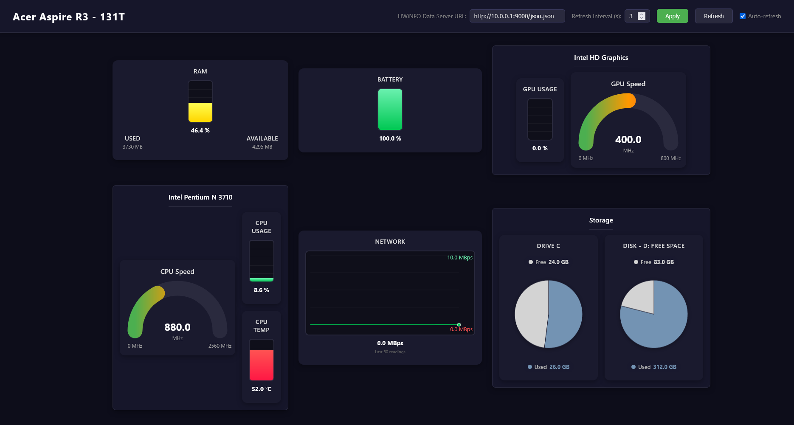

<div align="center">

# HWiNFO Dashboard

A modular web dashboard for visualizing real-time hardware sensor data from HWiNFO.



</div>

## Overview

This project is an addon for **[remotehwinfo](https://github.com/demion/remotehwinfo)** which serves as the JSON data server. The dashboard fetches sensor readings from the remotehwinfo API and displays them using configurable widgets.

## How It Works

1. **remotehwinfo** runs on the target machine and exposes HWiNFO sensor data as JSON at `/json.json`
2. The dashboard loads [`config.js`](config.js) to determine which widgets to render
3. Each widget automatically fetches the sensor values it needs from the JSON data
4. Data refreshes at configurable intervals and updates all widgets in real-time

## Getting Started

1. Set up [remotehwinfo](https://github.com/demion/remotehwinfo) on the machine running HWiNFO
2. Copy [`config.js`](config.js) and edit it with your server URL and widget configuration
3. Open [`dashboard.html`](dashboard.html) in a browser

## Configuration

Edit [`config.js`](config.js) to customize the dashboard:

```javascript
const dashboardConfig = {
    title: "My Machine",
    serverUrl: "http://10.0.0.1:9000/json.json",
    widgets: [ /* widget definitions */ ]
};
```

Each widget entry requires:
- **id** - Unique DOM element ID
- **type** - Widget type (must match one of the available widgets below)
- **order** - Display position (optional, widgets without order can be card children)
- **config** - Widget-specific configuration object

## Available Widgets

| Widget | Description | Config Details |
|--------|-------------|----------------|
| **Vertical Bar Graph** | Color-coded vertical bar for percentage or value metrics (CPU usage, temperature, etc.) | [`vertical-bar-graph.js`](widgets/vertical-bar-graph/vertical-bar-graph.js) |
| **Line Graph** | Horizontal timeline graph showing the last 60 readings of a sensor value | [`line-graph.js`](widgets/line-graph/line-graph.js) |
| **Speedometer Gauge** | Arc-style gauge with gradient colors for clock speeds or single values | [`speedometer-gauge.js`](widgets/speedometer-gauge/speedometer-gauge.js) |
| **2D Pie Chart** | Two-slice pie chart for displaying usage vs remaining (disk space, etc.) | [`2d-pie-chart.js`](widgets/2d-pie-chart/2d-pie-chart.js) |
| **Card** | Container widget that groups 2, 3 or 4 child widgets into a titled card layout | [`card.js`](widgets/card/card.js) |

Each widget JS file contains detailed documentation on configuration options and usage examples.

## Widget Architecture

All widgets extend [`WidgetBase`](widgets/WidgetBase.js) and implement:
- **render()** - Creates the DOM structure for the widget
- **update(data)** - Receives the full server data object and extracts the needed readings

The dashboard automatically registers all widgets and routes data updates to them. To create a custom widget, extend `WidgetBase` and register it in the `WidgetTypeMap` in [`dashboard.js`](dashboard.js).
